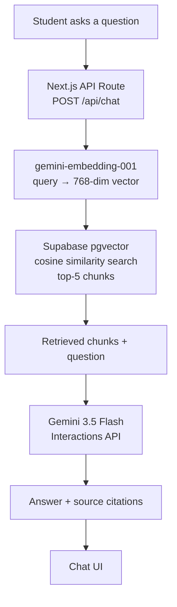
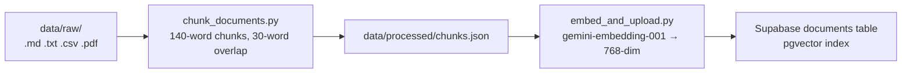

# Campus Saathi — Your AI Campus Companion 🎓

> **"No more chasing helpdesks."** A 24/7 AI chatbot that gives students and parents instant, grounded answers on admissions, eligibility, fees, hostels & placements — with source citations you can verify.

Built with **Next.js 16**, **Gemini AI**, and **Supabase pgvector** — for a 3-day RAG Hackathon.


---

## 📚 Table of Contents

- [What is this?](#-what-is-this)
- [Features](#-features)
- [How It Works (RAG Pipeline)](#-how-it-works-rag-pipeline)
- [Tech Stack](#-tech-stack)
- [Project Structure](#-project-structure)
- [Getting Started](#-getting-started)
- [Environment Variables](#-environment-variables)
- [Adding Your Own Campus Data](#-adding-your-own-campus-data)
- [Test Queries](#-test-queries)
- [Troubleshooting](#-troubleshooting)
- [Team](#-team)
- [License](#-license)

---

## ❓ What is this?

Campus Saathi is a **Retrieval-Augmented Generation (RAG) chatbot**. Instead of letting an AI guess answers, we:

1. **Store real campus documents** (admission brochures, fee structures, placement reports…) as vector embeddings in a database.
2. **Retrieve the most relevant chunks** for every student question.
3. **Ask Gemini to answer using ONLY that retrieved context** — so answers are grounded in real data and come with citations like `[1]`.

If the answer isn't in the knowledge base, the bot says so instead of making things up. 🤝

---

## ✨ Features

| Feature | Details |
|---|---|
| 💬 **AI Chat Interface** | Message bubbles, typing indicator, source citations `[1] [2]` |
| 🔍 **Document Search** | Search across campus docs with category filters + relevance scores |
| 📅 **Events & Notices** | Calendar, event cards, countdown timers, category filters |
| 🎙️ **Voice Input** | Web Speech API (Hindi + English) |
| 🌙 **Dark / Light Mode** | System preference detection + localStorage persistence |
| 📱 **Fully Responsive** | Mobile-first with hamburger drawer |
| 🗂️ **Topic Pages** | Dedicated pages: Admission, Placement, Services, Complaints, Events, Admin |
| 🎨 **Premium UI** | Glassmorphism, gradient animations, floating particles |

---

## 🔄 How It Works (RAG Pipeline)



<details>
<summary><b>Click for the data-ingestion side (how knowledge gets in)</b></summary>



**Why chunking?** Documents are split into ~140-word pieces so the AI can retrieve *exact* answers (like "library is open 8 AM–10 PM") instead of whole files.

**Why 768 dimensions?** The Supabase table schema (`vector(768)`) and the embedding model (`output_dimensionality=768`) are matched — mismatches cause errors.

</details>

---

## 🏗️ Tech Stack

| Layer | Technology | Why |
|---|---|---|
| **Framework** | Next.js 16 (App Router) | API routes + UI in one app |
| **Vector DB** | Supabase PostgreSQL + pgvector | Free, hosted, cosine search |
| **Embeddings** | Google `gemini-embedding-001` | 768-dim, supports dimensionality control |
| **LLM** | Gemini 3.5 Flash (Interactions API) | Fast, cheap, great for grounded Q&A |
| **Voice Input** | Web Speech API | No extra dependency |
| **Icons** | Lucide React | Clean icon set |
| **Fonts** | Inter + Outfit | Modern look |

> ⚠️ **Why not `text-embedding-004` / `gemini-1.5-flash`?** Google retired those models for new API keys (Aug 2026). This repo uses the replacements: `gemini-embedding-001` and `gemini-3.5-flash` via the **Interactions API** (`POST /v1beta/interactions`).

---

## 📁 Project Structure

```
campus-saathi/
├── frontend/                      # Next.js web application
│   ├── .env.local                 # API keys (NOT committed)
│   └── src/
│       ├── app/
│       │   ├── page.js            # Landing page
│       │   ├── chat/              # Chat interface
│       │   ├── search/            # Document search
│       │   ├── events/            # Events & notices
│       │   ├── admission/         # Admission info page
│       │   ├── placement/         # Placement info page
│       │   ├── services/          # Student services page
│       │   ├── complaints/        # Complaint registration page
│       │   ├── admin/             # Admin panel
│       │   └── api/
│       │       ├── chat/route.js  # POST /api/chat — RAG pipeline
│       │       ├── search/route.js# POST /api/search — doc search
│       │       └── events/route.js# GET /api/events
│       ├── components/            # Navbar, Hero, ChatMessage, EventCard…
│       ├── hooks/                 # useTheme, useVoiceInput, useChatHistory
│       ├── lib/rag/
│       │   ├── ragService.js      # ★ RAG core: retrieve → embed → generate
│       │   └── demoKnowledge.js   # Demo fallback data (no keys needed)
│       └── utils/constants.js
├── src/                           # Python backend (data pipeline)
│   ├── ingestion/chunk_documents.py   # Docs → chunks
│   ├── embeddings/embed_and_upload.py # Chunks → embeddings → Supabase
│   ├── retrieval/local_search.py      # Local fallback search (testing)
│   ├── llm/prompting.py               # Grounded prompt template
│   └── api/main.py                    # Optional FastAPI bridge
├── database/supabase/schema.sql   # ★ Run this in Supabase SQL Editor
├── data/
│   ├── raw/                       # Source documents (add yours here!)
│   └── processed/chunks.json      # Generated chunks (do not edit)
├── docs/                          # Guides, logs
├── tests/
├── requirements.txt               # Python dependencies
└── README.md
```

---

## 🚀 Getting Started

<details>
<summary><b>Step 1 — Prerequisites</b></summary>

- **Node.js** 18+ → https://nodejs.org
- **Python** 3.10+ (for the data pipeline)
- A **Gemini API key** → https://aistudio.google.com/app/apikey
- A **Supabase project** → https://supabase.com

</details>

<details>
<summary><b>Step 2 — Run the app (2 minutes)</b></summary>

```bash
# 1. Install frontend dependencies
cd frontend
npm install

# 2. Create your env file
cp .env.local.example .env.local
# ...then fill in your keys (see Environment Variables below)

# 3. Start the dev server
npm run dev
```

Open **http://localhost:3000/chat** 🎉

**No keys?** No problem — the app runs in **demo mode** with sample answers, so you can test the UI before connecting real data.

</details>

<details>
<summary><b>Step 3 — Connect real data (optional, 5 minutes)</b></summary>

```bash
# 1. Set up the database: run database/supabase/schema.sql in Supabase SQL Editor
# 2. Install Python deps
python -m venv .venv && source .venv/bin/activate
pip install -r requirements.txt

# 3. Copy your keys for the Python pipeline
cp .env.example .env    # fill GOOGLE_AI_API_KEY, SUPABASE_URL, SUPABASE_SERVICE_ROLE_KEY

# 4. Put your campus docs in data/raw/ (.md, .txt, .csv, .pdf)

# 5. Chunk → Embed → Upload to Supabase
python src/ingestion/chunk_documents.py
python src/embeddings/embed_and_upload.py
```

That's it — the next question you ask will use your real data. ✅

</details>

---

## 🔑 Environment Variables

Two files, same values:

| Variable | File | Purpose |
|---|---|---|
| `GOOGLE_AI_API_KEY` | both | Gemini LLM + embeddings |
| `NEXT_PUBLIC_SUPABASE_URL` | `frontend/.env.local` | Supabase project URL |
| `NEXT_PUBLIC_SUPABASE_ANON_KEY` | `frontend/.env.local` | Public read key (publishable) |
| `SUPABASE_SERVICE_ROLE_KEY` | both | Server-side writes (secret) |
| `SUPABASE_URL` | root `.env` | Same as NEXT_PUBLIC…, for Python scripts |

<details>
<summary><b>Click for exact file contents</b></summary>

**`frontend/.env.local`**
```env
GOOGLE_AI_API_KEY=your_key_here
NEXT_PUBLIC_SUPABASE_URL=https://your-project.supabase.co
NEXT_PUBLIC_SUPABASE_ANON_KEY=your_publishable_key
SUPABASE_SERVICE_ROLE_KEY=your_secret_key
```

**`.env` (project root, for Python)**
```env
GOOGLE_AI_API_KEY=your_key_here
SUPABASE_URL=https://your-project.supabase.co
SUPABASE_SERVICE_ROLE_KEY=your_secret_key
```

</details>

> 🔒 **Security:** Never commit `.env` / `.env.local` (already gitignored). Never share the service role key — it can read/write the whole database. Invite teammates to Supabase via email instead.

---

## 📄 Adding Your Own Campus Data

Drop files into `data/raw/` — supported formats: `.md` `.txt` `.csv` `.pdf`

<details>
<summary><b>Click for the files currently in the knowledge base</b></summary>

| File | Category | Covers |
|---|---|---|
| `admission_brochure.md` | admissions | Eligibility, documents, counselling, dates, quotas |
| `fee_structure.md` | general | Tuition, hostel fees, refunds, late fees |
| `scholarship_details.md` | general | Govt + institutional scholarships, renewal rules |
| `hostel_rules.md` | general | Allotment, timings, mess, discipline |
| `library_timings.md` | facilities | Hours, sections, issuing rules, fines |
| `complaint_services.md` | facilities | Registration, categories, tracking, escalation |
| `placement_report.md` | placements | Stats, recruiters, process, prep |
| `events_notices.md` | events | Tech fest, cultural fest, sports, notices |
| `admissions.md` | admissions | Original summary doc |
| `placements.md` | placements | Original summary doc |
| `student_services.md` | facilities | Original summary doc |

</details>

**Tip:** name files by topic — the chunker auto-detects category from filenames containing `admission`, `placement`, `library`, `service`, `event`, `course`, `faculty`.

After adding files, re-run:
```bash
python src/ingestion/chunk_documents.py
python src/embeddings/embed_and_upload.py
```

---

## 🧪 Test Queries

Try these in the chat:

- ❓ *What documents are required for B.Tech admission?*
- ❓ *What are the library timings?*
- ❓ *What are the placement statistics?*
- ❓ *How do I register a complaint?*
- ❓ *What is the fee structure?*
- ❓ *How do I apply for a scholarship?*
- ❓ *What are the hostel rules?*

Each answer should include numbered citations `[1]` linking back to the source documents.

---

## 🛠️ Troubleshooting

<details>
<summary><b>"This model is no longer available to new users"</b></summary>

Old models (`text-embedding-004`, `gemini-1.5-flash`, `gemini-2.5-flash`) are retired for new API keys. This repo already uses:
- `gemini-embedding-001` (embedding, 768-dim via `output_dimensionality`)
- `gemini-3.5-flash` (chat, via the Interactions API)

Update any old references in your forks to match.

</details>

<details>
<summary><b>Chat answers look like raw document dumps</b></summary>

That's the fallback path — it means the Gemini call failed (wrong/missing `GOOGLE_AI_API_KEY`) but retrieval still worked. Check the terminal for `Gemini generation failed: …`.

</details>

<details>
<summary><b>"Could not find the table public.documents"</b></summary>

You haven't run `database/supabase/schema.sql` yet. Open Supabase → **SQL Editor** → paste the file → **Run**.

</details>

<details>
<summary><b>Embedding dimension mismatch on upload</b></summary>

The table expects `vector(768)` and the model outputs 768 via `output_dimensionality=768`. If you changed models, update both `schema.sql` and `embed_and_upload.py` consistently.

</details>

---

## 👥 Team

| Name | Role |
|---|---|
| You | Lead / Integration & Architecture |
| Satakshi | AI/ML + Database |
| Raj | Frontend + AI/ML Support |
| Palkesh | Backend |
| Prakriti | Backend |
| Ankit | Backend → Research/Pitch |
| Tejaswini | Design/UX + Research/Pitch |

---

## 🗓️ Hackathon Roadmap

- **Day 1 — Foundation:** Repo, Next.js frontend, design system, chat/search/events UI
- **Day 2 — Integration:** Real data pipeline, Supabase pgvector, Gemini, end-to-end RAG, citations
- **Day 3 — Polish:** Testing, UI polish, PPT, architecture diagram, demo rehearsal

---

## 📄 License

Built for educational and hackathon purposes (SIH). MIT badge shown for reference.
